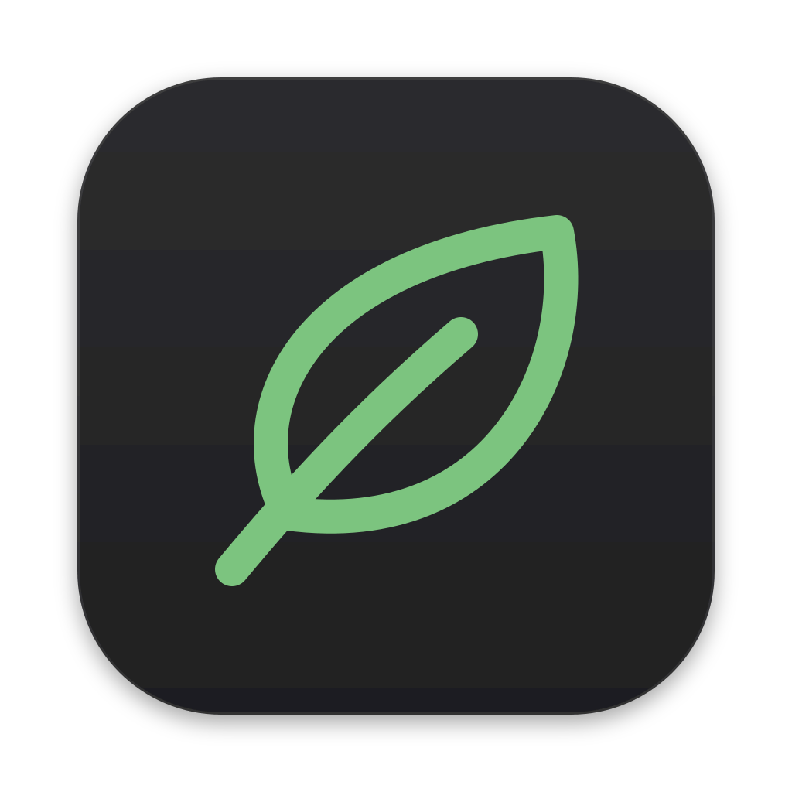

<p align="center">
  
</p>

# Upkeep

**A native macOS cleanup and storage utility for Apple Silicon.**

*Keep your Mac clean, without the guesswork.*

Upkeep scans your Mac for data that can safely be regenerated or removed: application caches, old logs and crash reports, stale temporary files, your Trash, Xcode and Homebrew leftovers, and package-manager caches. It shows exactly what it found, how much space each item uses and why it's a candidate. Nothing is removed until you select it and confirm.

> **Important:** Upkeep does not guarantee that every detected item is safe to remove in every setup. Its rules are conservative and it re-checks every item right before removal, but **you remain in control of what gets cleaned.** Review what's selected before you confirm, especially items marked **Review**.

---

## Contents

- [What it does](#what-it-does)
- [Features](#features)
- [Supported cleanup categories](#supported-cleanup-categories)
- [Safety model](#safety-model)
- [Architecture](#architecture)
- [Installation](#installation)
- [Development setup](#development-setup)
- [Building](#building)
- [Testing](#testing)
- [Security considerations](#security-considerations)
- [Permissions](#permissions)
- [Known limitations](#known-limitations)
- [Roadmap](#roadmap)
- [Contributing](#contributing)

## What it does

1. **Scans** your user-level folders with deterministic, category-specific scanners.
2. **Classifies** every finding as **Safe**, **Review** or **Protected**, with a plain-language reason.
3. **Measures** real on-disk (allocated) size, counting hard links once and never following symlinks.
4. **Shows** categories and individual items: name, path, size, date, safety level. Each item can be revealed in Finder.
5. **Cleans** only what you select, after a confirmation that lists exactly what will be removed.
6. **Re-validates** each item immediately before removal, removes it with a confined, symlink-proof remover, **verifies** it's gone and reports the space actually reclaimed.

All numbers come from your real file system and from the tools themselves. Nothing in the app is hard-coded or simulated.

## Features

- Native **SwiftUI** app for macOS 14+, built for Apple Silicon (arm64). No Electron and no third-party dependencies.
- **Dashboard** with available, used and total storage (native `URLResourceValues`), plus the time of the last scan.
- **Live scan progress**: current category, items analyzed, space discovered and the path being analyzed. Scans can be stopped.
- **Results** summary with category cards, tri-state checkboxes, sizes, file counts and safety indicators.
- **Item browser** per category: a sortable, searchable table with Reveal in Finder, Copy Path and a details pane (full path, reason, notes, cleanup method).
- **Cleanup confirmation** ("You're about to remove 8.4 GB") with per-category totals and warnings for permanent or Review items.
- **Cleanup progress and summary**: reclaimed bytes, removed, skipped and failed counts with reasons, and available space before and after.
- **Large Files** section, which is informational only and never deletes.
- **Scan Issues** view explaining every location that couldn't be read, with a direct link to the right privacy settings.
- **Menu bar** item showing the last scan and reclaimable size, with Scan Now, Open Upkeep, Settings and Quit.
- **Settings** window for scan frequency, category toggles, age thresholds, confirmation, Move to Trash, protected items, developer folders, notifications and the menu bar item.
- Optional, rate-limited **notification** after scheduled scans ("Upkeep found 8.2 GB of reclaimable storage.").
- **Dark and Light Mode**, semantic fonts, VoiceOver labels and keyboard shortcuts (⌘R scan, ⌘. stop, ⇧⌘⌫ clean selected).
- Structured logging with Apple's unified logging (`os.Logger`).
- A **read-only debug CLI** (`upkeep-cli`) for exercising the engine from Terminal.

## Supported cleanup categories

| Category | Where | Risk | How it's cleaned |
|---|---|---|---|
| **Application Caches** | Top-level folders in `~/Library/Caches` named like bundle identifiers, plus a small list of known vendor caches | Safe; **Review** if the owning app is running | Folder removed (or moved to Trash) |
| **Logs** | Files in `~/Library/Logs` older than *N* days (default 14) | Safe | File removed |
| **Crash Reports** | `.ips`/`.crash`/`.diag`/`.spin`/`.hang`… in `~/Library/Logs/DiagnosticReports` older than *N* days (default 30), with app name and date | Safe | File removed |
| **Temporary Files** | Top-level items in your per-user temp folder (`/var/folders/…/T`) that you own and whose newest content is older than *N* days (default 3) | Safe | Item removed |
| **Trash** | Top-level items in `~/.Trash`, largest first | **Review**, marked **Permanent** | Deleted permanently |
| **Xcode** | `DerivedData` projects | Safe; **Review** if Xcode is running | Folder removed |
| | Archives (`.xcarchive`) | **Review** | Folder removed |
| | iOS/watchOS/tvOS/visionOS DeviceSupport | **Review** | Folder removed |
| | CoreSimulator caches | **Review** | Folder removed |
| | Simulators whose runtime is no longer installed | **Review** | `xcrun simctl delete <UDID>` |
| **Homebrew** (shown only if installed) | Whatever `brew cleanup --dry-run` reports: cached downloads, old versions, other | Safe | `brew cleanup` |
| **Swift Package Manager** | Children of `~/Library/Caches/org.swift.swiftpm` | Safe | Folder removed |
| **Node Package Managers** | `~/.npm/_cacache`, `_npx`, `_logs`; Yarn cache; Yarn Berry global cache; pnpm store | Safe (pnpm store: **Review**) | `npm cache clean --force`, `yarn cache clean`, `pnpm store prune` when the tool is installed; otherwise the cache folder is removed (pnpm store is never deleted directly) |
| **Python Caches** | pip cache; `__pycache__` folders containing only `.pyc`/`.pyo`, inside developer folders **you** add in Settings | Safe | Folder removed |
| **Large Files** | Files ≥ threshold (default 1 GB) in your home folder, excluding Library and Trash | Informational | **Never removed.** Reveal in Finder only |

Categories that don't apply to your Mac (for example, Homebrew isn't installed) are hidden.

### What Upkeep never cleans

Documents, Desktop, Downloads, Pictures, Movies, Music, iCloud Drive (`Mobile Documents`, `CloudStorage`), Photos libraries, Mail, Messages, Safari data, cookies, preferences, keychains, SSH/GPG/cloud credentials, `.env` files, Git repositories, `node_modules`, project folders, `Application Support`, containers, `/System`, `/Library`, `/usr`, `/Applications`, and anything it cannot confidently classify. A cache folder is also protected if it contains anything whose name suggests credentials or source history (for example `.git`, `.ssh`, `.env`, `*.keychain-db`, `*.p12`).

## Safety model

Every cleanup candidate is produced by a **rule** (`Rules/RuleBook.swift`). Each rule has a category, a human-readable explanation, a risk classification, the approved roots it may operate in, the cleanup methods it allows, and a single deterministic predicate that is used **both at scan time and again right before removal**.

```swift
public enum CleanupRisk { case safe, review, protected }
```

- **Safe**: regenerable data. Pre-selected after a scan.
- **Review**: probably removable, but you should look first (archives, device support, Trash, running apps). **Never pre-selected**, and checking a category selects only its Safe items. Review items are chosen individually, unless the category contains nothing else, as with the Trash.
- **Protected**: never cleaned. Hidden by default; turn on *Show protected items* to see what was left alone and why.

Each `CleanupItem` carries `reason`, `source`, `url`, `rootURL`, `size`, `fileCount`, `modifiedDate`, the file's `identity` (device + inode) at scan time, its `method`, and any notes.

### What happens when you click Clean Selected

For each item, `CleanupExecutor`:

1. Confirms the item's root is still one of the **approved cleanup roots** for its rule.
2. **Validates the path** (`PathValidator`):
   - no `.`/`..` components,
   - the parent's canonical path (`realpath`) lies strictly inside the canonical approved root,
   - the item isn't a protected path, doesn't contain one, and isn't inside a protected area unless the approved root is also inside it,
   - no credential or source-control names along the path.
3. Checks the item **still exists** and is the **same file-system object** as at scan time. A replaced item is skipped.
4. **Re-runs the rule** against fresh metadata and a fresh measurement. An item that no longer matches is skipped, for example a log that was written to since the scan, or a cache whose app has since launched.
5. **Removes it** with the confined remover (see below), or moves it to the Trash if you enabled that setting and the item allows it.
6. **Verifies** removal and records the bytes actually freed. Partial removals, items recreated by their app, skips and failures are each reported with a reason.

One item failing never stops the others, and nothing throws past the engine.

### The confined remover

`LocalFileSystem.removeItem` never deletes by path string. It opens the approved root's canonical path, then walks down one component at a time with `openat(…, O_DIRECTORY | O_NOFOLLOW)`. It inspects entries with `fstatat(AT_SYMLINK_NOFOLLOW)` and removes them with `unlinkat` relative to directory file descriptors. As a result:

- A symlink swapped into the path **after validation** makes removal fail instead of escaping the root.
- Symlinks inside a folder being removed are **unlinked themselves**; their targets are never touched.
- Removal never crosses onto another volume (mount points are skipped).
- File names are passed back to the kernel as the exact bytes read from the directory, so Unicode and unusual names are handled correctly.

## Architecture

```
Upkeep.xcodeproj                  Xcode project (app target + local package)
Upkeep/                           macOS app (SwiftUI + AppKit)
├── App/
│   ├── UpkeepApp.swift           Scenes: main window, Settings, MenuBarExtra, commands
│   └── AppState.swift            Main-actor view model: scan/cleanup orchestration, selection, scheduling
├── Services/
│   ├── SettingsStore.swift       Settings persistence + security-scoped folder bookmarks
│   ├── PermissionService.swift   Full Disk Access check, NSOpenPanel, Finder, chip detection
│   └── NotificationService.swift Rate-limited user notifications
├── Views/
│   ├── ContentView.swift         NavigationSplitView shell
│   ├── DashboardView.swift       Header card (identity + storage) and permission banner
│   ├── ScanView.swift            Scan card: idle / scanning / cleaning progress
│   ├── ResultsView.swift         Summary + category cards
│   ├── CategoryView.swift        Item table + details pane
│   ├── CleanupConfirmationView.swift  Confirmation sheet + cleanup summary
│   ├── LargeFilesView.swift      Large files + scan issues
│   ├── SettingsView.swift        Settings window
│   ├── MenuBarView.swift         Menu bar menu
│   └── Components/Card.swift     Card, icon tile, badges, checkbox, storage bar…
└── Resources/Assets.xcassets     App icon, accent and tile colors

Packages/UpkeepCore/              Platform-independent engine (Swift package)
├── Sources/UpkeepCore/
│   ├── Models/                   CleanupItem, CleanupCategory, CleanupRisk, ScanResult, StorageSummary, UpkeepSettings
│   ├── FileSystem/               FileSystemService protocol, LocalFileSystem (POSIX), PathValidator, SensitiveNames
│   ├── Rules/                    CleanupRule + RuleBook (all rules)
│   ├── Scanner/                  ScanEnvironment, ScanCoordinator, one scanner per category
│   ├── Cleanup/                  CleanupEngine (scan/calculateSize/preview/cleanup/verify), CleanupExecutor, CleanupPlan
│   ├── Services/                 ToolRunner (Process), ToolLocator, HomebrewService, SimulatorService, DiskSpaceService
│   └── Utilities/                UpkeepLog (os.Logger), Formatting
├── Sources/UpkeepCLI/            Read-only debug harness
└── Tests/UpkeepCoreTests/        XCTest suite (fixtures in temporary directories)

Design/AppIcon.svg                Vector app icon
```

**Design choices**

- The engine is a separate package with no UI dependencies. It builds and tests on macOS and, for CI convenience, on Linux as well.
- `ScanEnvironment` describes *where things live*. Every scanner derives its paths from it, so tests point the entire engine at a fixture tree and never at real user folders.
- `FileSystemService` and `ToolRunning` are protocols. Tests inject fault-injecting and mock implementations to cover permission errors, recreated caches and tool failures.
- Scans run in detached tasks off the main thread. A lock-protected progress reporter is sampled ten times a second by the UI instead of flooding the main actor. Scans and cleanups are cancellable.
- Tool commands form a **closed enum** (`ToolCommand`). There is no way to construct an arbitrary command line.

## Installation

Upkeep isn't notarized or distributed yet. Build it from source (below), then copy `Upkeep.app` to `/Applications`.

The app is ad-hoc signed ("Sign to Run Locally"). On first launch, macOS may ask you to confirm opening it (Control-click › Open).

## Development setup

Requirements:

- macOS 14 Sonoma or later on Apple Silicon (Intel works but isn't the focus)
- **Xcode 16 or later** (the project uses synchronized folders, project format 77)

```bash
git clone https://github.com/Akshay6890/Upkeep.git
cd Upkeep
open Upkeep.xcodeproj
```

The app target depends on the local `Packages/UpkeepCore` package, which Xcode resolves automatically. There are no external dependencies.

## Building

In Xcode, select the **Upkeep** scheme and press ⌘R. From the command line:

```bash
xcodebuild -project Upkeep.xcodeproj -scheme Upkeep -configuration Release \
  -destination 'platform=macOS,arch=arm64' build
```

To use your own signing identity, set your team in *Signing & Capabilities*. The project defaults to ad-hoc "Sign to Run Locally" with the Hardened Runtime enabled.

## Testing

```bash
cd Packages/UpkeepCore
swift test
```

Or press ⌘U on the **Upkeep** scheme in Xcode, which includes the `UpkeepCoreTests` target.

The suite has **107 tests**. Every test builds its own tree in a unique temporary directory; **no test touches real user folders**, and tools are never executed (a mock runner returns canned output). Coverage includes:

- **Rule matching**: bundle-identifier detection, protected and claimed caches, running apps, vendor caches, Python bytecode, Yarn root disambiguation, allowed methods per rule.
- **Path validation**: traversal (`..`), `.` components, symlinked parents pointing outside, the root itself, protected folders, sensitive names, spaces and Unicode.
- **Size calculation**: symlinks not followed, hard links counted once, newest-content dates, permission-denied subfolders, 5,000-file directories.
- **Age filtering**: logs, crash reports and temporary folders judged by their newest content.
- **Risk classification**: DerivedData Safe (Review while Xcode runs), archives, device support and Trash Review, protected system caches.
- **Homebrew and Xcode detection**, untrusted (world-writable) tool executables, `brew cleanup --dry-run` and `simctl` JSON parsing, UDID validation.
- **Scanner behavior** per category, including that scanning is read-only.
- **Cleanup and verification**: end-to-end removal, dry run, Trash, move-to-Trash, tool-based cleanup, freed-space accounting.
- **Dangerous cases**: symlink escapes, a parent directory swapped for a symlink after validation (TOCTOU), items deleted, replaced or modified between scan and cleanup, items that became riskier, forged items outside approved roots, traversal paths, permission errors (partial removal), caches recreated by their app, and very large directories.

Permission tests use `chmod`, which has no effect when running as root. They are skipped in that case and run normally as a regular user.

### Debug CLI

`upkeep-cli` is an internal harness. It **cannot delete anything**: `cleanup` only accepts `--dry-run`.

```bash
cd Packages/UpkeepCore
swift run upkeep-cli scan                                  # scan all categories
swift run upkeep-cli scan --category caches                # one category
swift run upkeep-cli scan --category homebrew --json       # JSON output
swift run upkeep-cli scan --large-files
swift run upkeep-cli cleanup --dry-run                     # what would be removed (Safe items)
swift run upkeep-cli cleanup --dry-run --include-review
swift run upkeep-cli categories
# Point it at a fixture instead of your home folder:
swift run upkeep-cli scan --home /tmp/fake-home --tmp /tmp/fake-tmp --dev-folder ~/code/app
```

## Security considerations

Upkeep deletes files, so its design assumes paths can be hostile and state can change at any moment.

- **Allowlist of cleanup roots.** File-system cleanup happens only strictly inside approved roots, and each rule declares which root kinds it may use. The roots are `~/Library/Caches`, `~/Library/Logs`, `DiagnosticReports`, `~/.Trash`, the per-user temp folder, Xcode's DerivedData, Archives and DeviceSupport, CoreSimulator caches, `~/.npm`, `~/.yarn/berry`, `~/Library/pnpm`, and developer folders you add explicitly.
- **Protected paths.** A deny-list of user-data and system locations is checked independently of the rules.
- **No symlink following** anywhere in scanning, measuring or removal. Candidates that are symlinks are ignored.
- **Race protection.** Identity checks (device + inode), rule re-evaluation and the `openat`/`O_NOFOLLOW` descent protect against items changing between scan and cleanup. An item that became riskier since the scan is skipped.
- **Path traversal prevention.** `.`/`..` components are rejected, and containment is checked on canonical paths.
- **Controlled tool execution.** Tools run through `Process` with a fixed executable URL, an argument array (never a shell), a minimal environment (no inherited secrets) and a timeout. Executables are only taken from fixed locations (never your shell `PATH`) and must be owned by root or you and not world-writable. Simulator UDIDs are validated as UUIDs.
- **Logging hygiene.** Logs never include file contents, credentials or environment variables. Paths are logged with `privacy: .private`.
- **No privilege escalation.** Upkeep runs as you, never asks for an administrator password, and doesn't touch `/System`, `/Library` or other users' files.

## Permissions

| Permission | Why | Required? |
|---|---|---|
| **Full Disk Access** (System Settings › Privacy & Security) | macOS protects `~/.Trash` and some app caches. Without it, those are skipped and listed under *Scan Issues*. | Optional |
| **Desktop, Documents, Downloads** | Requested by macOS the first time you run a Large Files scan, or if a developer folder lives there. | Only for those features |
| **Notifications** | Optional message after scheduled scans. | Optional |

Upkeep is **not sandboxed**, because a sandboxed app can't see other apps' caches in `~/Library/Caches`. It uses the Hardened Runtime and requests access only through standard macOS mechanisms. Developer folders are chosen with `NSOpenPanel` and remembered with bookmarks (security-scoped when available). The architecture keeps every location in `ScanEnvironment` and `approvedRoots`, so more permission-protected locations can be added later.

## Known limitations

- **Sizes** are allocated bytes on disk. APFS clones and snapshots can make the space actually freed differ from the estimate. After cleanup, Upkeep shows both the bytes it removed and the volume's real available space, which macOS may update with a delay.
- **Homebrew** sizes are Homebrew's own estimates. **`pnpm store prune`** only removes unreferenced packages, so it may free less than the store size shown.
- Only top-level Trash items in `~/.Trash` are handled. Trash folders on other volumes aren't scanned.
- Scheduled scans run only while Upkeep is running (for example, with the menu bar item enabled). There is no background launch agent, by design.
- File identity uses device and inode numbers. APFS doesn't reuse inode numbers, but some other file systems do. Rule re-evaluation and the confined remover still apply in that case.
- `__pycache__` cleanup only covers developer folders you add. Upkeep doesn't search your disk for them.
- Large Files is informational: there is intentionally no delete button.
- Not notarized, no auto-update, no localizations other than English yet.

## Roadmap

- Notarized, signed releases and an update mechanism
- `brew autoremove` (unused dependencies) as a Review item
- Per-volume Trash support
- Optional launch-at-login helper for scheduled scans (`SMAppService`)
- Docker, Gradle/Maven, CocoaPods and Carthage cache rules
- Per-app cache history ("this cache grows by 2 GB a week")
- Exportable cleanup reports
- Localization

## Contributing

Contributions are welcome. Safety is the top priority, so:

1. **Every new rule** needs a category, explanation, risk level, approved root kind(s), allowed methods and a deterministic predicate in `RuleBook`. It also needs tests for matching *and* non-matching cases.
2. **Never** add a rule that deletes outside an approved root, follows symlinks or builds a command line from a path.
3. When in doubt, classify as **Review**. When still in doubt, **Protected**.
4. Run `swift test` in `Packages/UpkeepCore` and build the app before opening a pull request.
5. Tests must use fixtures in temporary directories, never real user folders.

---

Upkeep is an independent project and isn't affiliated with Apple Inc. Homebrew, Xcode, npm, Yarn, pnpm and Python are trademarks of their respective owners.
